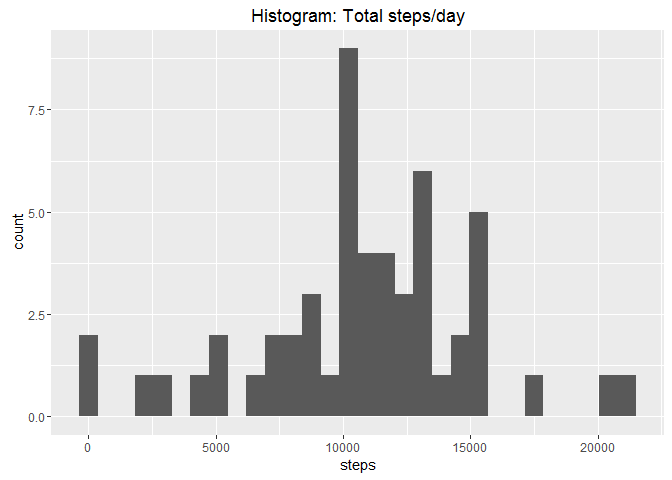
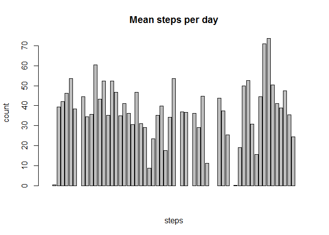
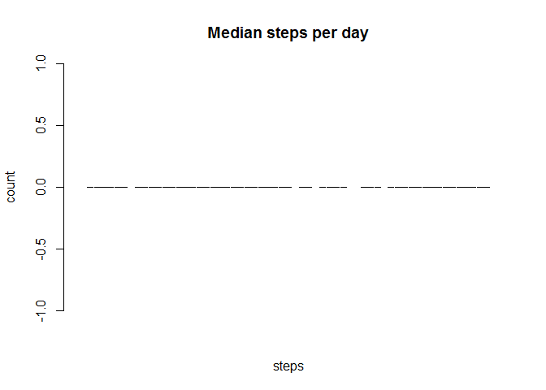
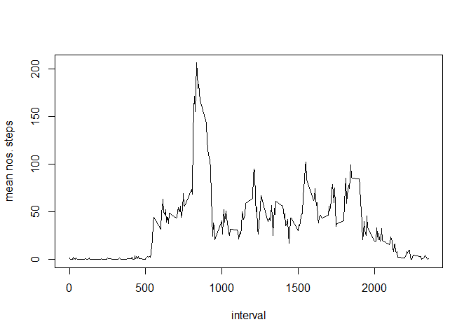
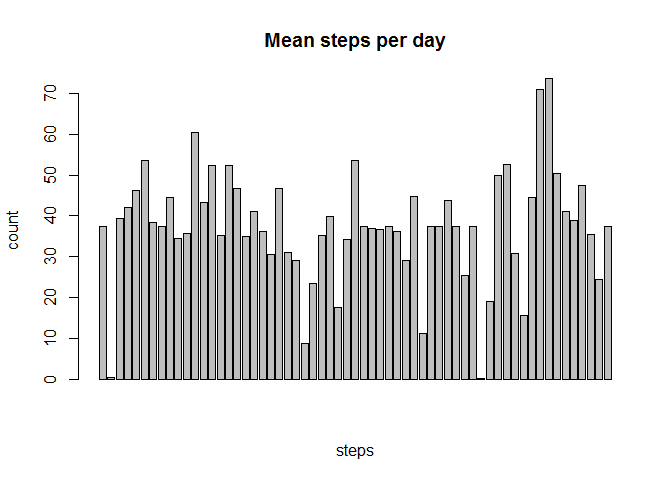
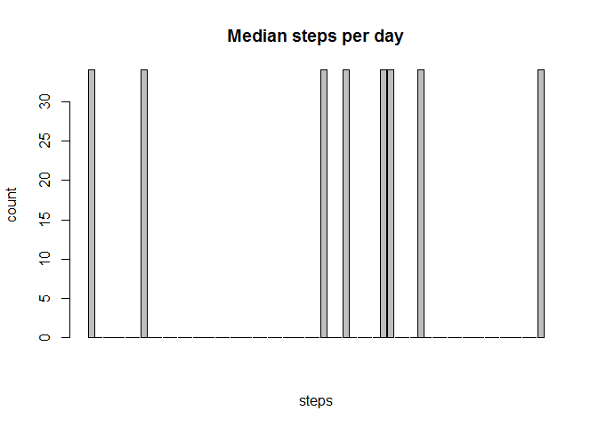
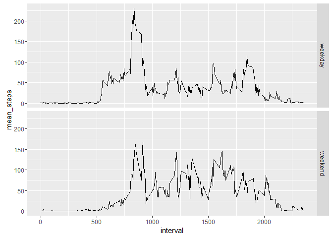

# PA1_template
Tricael  
May 21, 2016  

This report details the necessary code as well as the solutions to Course Project 1 Assignment. Details of the project, questions, and data can be found at the [GitHub site] (https://github.com/rdpeng/RepData_PeerAssessment1). The project was forked.  

The data was first downloaded and loaded into RStudio with the following packages


The packages to be used were also loaded using the *library* command.  

The only processing needed at the start was to convert the variable 'date' using lubridate.

```r
activity.dat<-mutate(activity.dat,date=parse_date_time(date,"%Y%m%d"))
```

###Q1a. Calculate the total number of steps taken per day

```r
activity.grouped<-group_by(activity.dat,date)
activity.summary<-summarize(activity.grouped,total_steps=sum(steps),mean_steps=mean(steps),median_steps=median(steps))
```

###Q1b. Histogram of total number of steps taken each day
NAs have been automatically removed from the plot and show up as empty spaces.
<!-- -->

###Q1c. Calculate and report the mean and median of the total number of steps taken per day
As seen from the boxplots, the median steps is 0 throughout.
<!-- --><!-- -->

###Q2a. Make a time series plot (i.e. type = "l") of the 5-minute interval (x-axis) and the average number of steps taken, averaged across all days (y-axis)

```r
activity.grp2<-activity.dat
activity.grp2<-group_by(activity.dat,interval)
grp2.summary<-summarize(activity.grp2,mean.steps=mean(steps,na.rm=TRUE),sum.steps=sum(steps,na.rm=TRUE))
plot(grp2.summary$interval,grp2.summary$mean.steps,type="l",xlab="interval",ylab="mean nos. steps")
```

<!-- -->

###Q2b. Which 5-minute interval, on average across all the days in the dataset, contains the maximum number of steps?

```
## [1] 835
```

###Q3a. Calculate and report the total number of missing values in the dataset (i.e. the total number of rows with NAs)

```
## [1] 2304
```

###Q3b.Devise a strategy for filling in all of the missing values in the dataset and create a new dataset that is equal to the original dataset but with the missing data filled in.
We simply replace the missing values for that interval with the mean value of that interval as averaged across *all* days. This uses tidyr but *melt* and *cast* functions work as well.

```r
NA.removed<-spread(activity.dat,interval,steps)
temp<-NA.removed[2:289]
dat.colMeans<-colMeans(temp,na.rm=TRUE)
index<-which(is.na(temp),arr.ind=TRUE)
temp[index]<-dat.colMeans[index[,2]]
NA.removed[2:289]<-temp
```
    
###Q3c. Make a histogram of the total number of steps taken each day and Calculate and report the mean and median total number of steps taken per day. Do these values differ from the estimates from the first part of the assignment? What is the impact of imputing missing data on the estimates of the total daily number of steps?
Comparing Q1b and Q3c plots, we find that they are the same, except that the missing values (NA) have been replaced by the mean values of that interval averaged across all days.
<!-- --><!-- -->

###Q4a. Create a new factor variable in the dataset with two levels - "weekday" and "weekend" indicating whether a given date is a weekday or weekend day.

```r
weekdayerizer<-mutate(NA.removed,day=wday(date),wkd=(ifelse(day%in%c(1,7),"weekend","weekday")))
weekdayerizer$wkd<-as.factor(weekdayerizer$wkd)
weekdayerizer$interval<-as.numeric(weekdayerizer$interval)
```

###Q4b. Make a panel plot containing a time series plot of the 5-minute interval (x-axis) and the average number of steps taken, averaged across all weekday days or weekend days (y-axis).
<!-- -->
